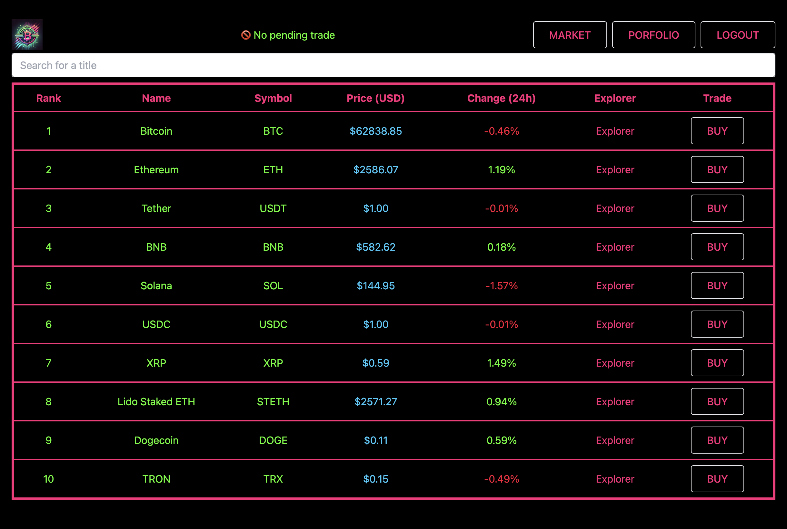

# Clean React template

This project is a boilerplate for a React app which could be easier to maintain if it gets bigger.



## Install

```
yarn
yarn test
```

## Architecture

- `src/app` : React App : pages and (dumb) components
- `src/core` : state of the app, wrapped in an `CryptoTradingApp` instance.
- `src/infrastructure` : API services (and mocks) used by `core`


